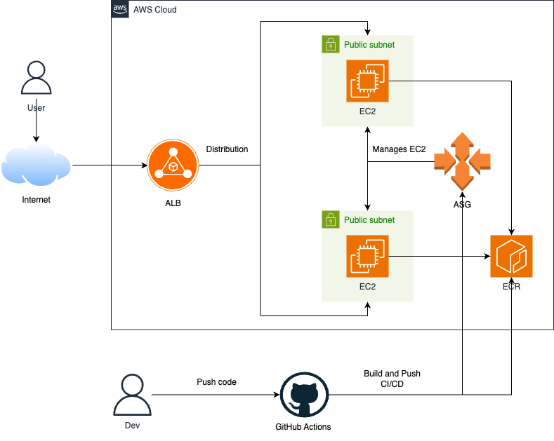

# Golden Owl DevOps Internship - Technical Test
Submitted by: Nguyen Gia Bao (GiaBao1006)

DNS: http://golden-owl-alb-818433596.us-east-1.elb.amazonaws.com

## Your Mission 🌟
Your mission, should you choose to accept it, is to craft a CI job that:
1. Forks this repository to your personal GitHub account.
2. Dockerizes a Node.js application.
3. Establishes an automated CI/CD build process using GitHub Actions workflow and a container registry service such as DockerHub or Amazon Elastic Container Registry (ECR) or similar services.
4. Initiates CI tests automatically when changes are pushed to the feature branch on GitHub.
5. Utilizes GitHub Actions for Continuous Deployment (CD) to deploy the application to major cloud providers like AWS EC2, AWS ECS or Google Cloud (please submit the deployment link).

## Tech Stack
1. Cloud: AWS (Amazon Web Services)
        Compute: EC2 (Elastic Compute Cloud)
        Networking: VPC, Subnets, Route Tables, Internet Gateway, ALB
        Scaling & HA: Auto Scaling Group (ASG)
        Container Registry: ECR (Elastic Container Registry)

2. Infrastructure as Code: Terraform

3. Containerization: Docker

4. CI/CD: GitHub Actions

5. Application: Node.js

## Architecture Diagram

## How To Deploy
Prerequisites:

    Terraform CLI installed.
    
    AWS CLI installed and configured.
    
    Docker installed and running.

### 1. Terraform (Infrastructure):

    Navigate to the terraform directory and apply the configuration to create the AWS infrastructure.

    Navigate to the terraform directory

    cd terraform

    Initialize Terraform

    terraform init

    (Optional) Plan the changes

    terraform plan

    Apply the configuration to create the infrastructure

    terraform apply

### 2. Docker (Manual Build & Push for First Deployment):

This is required one time to give the EC2 instances an image to pull.
Note: You must replace [ACCOUNT_ID], [REGION], and [ECR_REPOSITORY_URL] with your actual values from the terraform output.

    Navigate to the root directory (where the Dockerfile is)

    cd ..

    Log in to Amazon ECR
 
    aws ecr get-login-password --region [REGION] | docker login --username AWS --password-stdin [ACCOUNT_ID].dkr.ecr.[REGION].amazonaws.com

    Build the Docker image (for the EC2 platform, linux/amd64)

    docker buildx build --platform linux/amd64 -t [ECR_REPOSITORY_URL]:latest .

    Push the image to ECR

    docker push [ECR_REPOSITORY_URL]:latest

### 3. GitHub CI/CD Pipeline:

CI (Continuous Integration): Automatically runs npm test on every Pull Request to ensure code quality.

CD (Continuous Deployment): Automatically builds, pushes, and deploys the application with zero-downtime (via Rolling Update) on every merge to the master branch.

## Important
Create a new user in the IAM console with AmazonEC2ContainerRegistryFullAccess and AutoScalingFullAccess policies. Then, create an Access Key and Secret Key for this user and add them to the GitHub repository's Secrets (AWS_ACCESS_KEY_ID, AWS_SECRET_ACCESS_KEY, AWS_REGION, ASG_NAME). This is required for the CD pipeline to work.

## Clean all

    cd terraform

    terraform destroy #Destroy the Terraform-managed infrastructure

